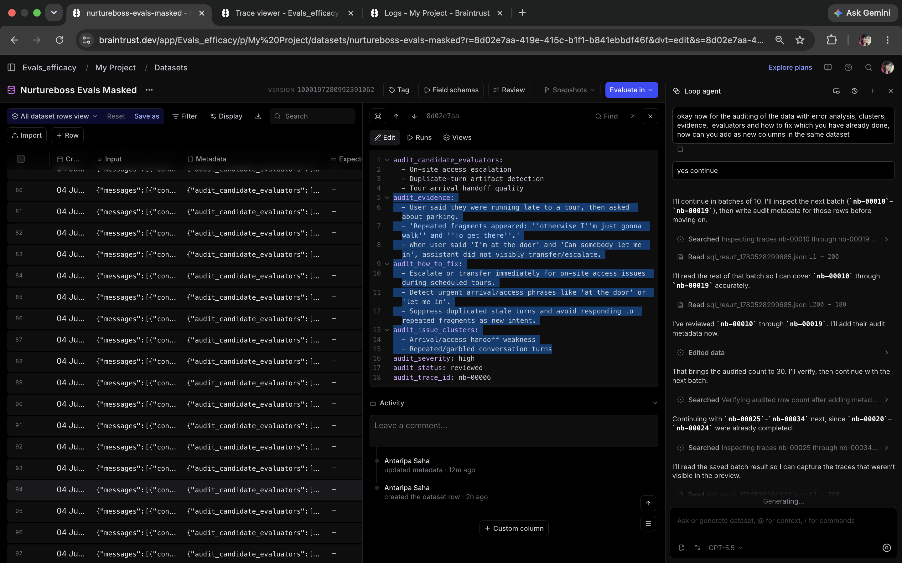
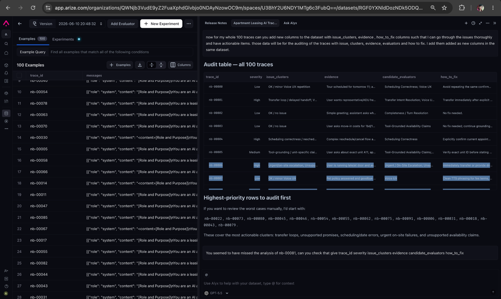
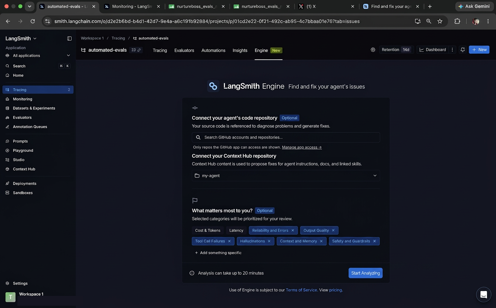
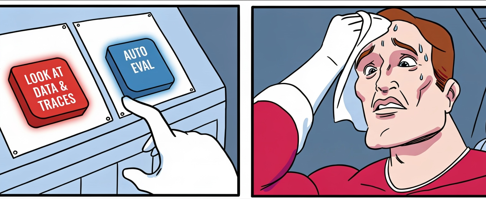

```{=html}
<style>
/* Center all figure captions across this post, including on mobile */
figcaption, .figure-caption, .quarto-layout-panel figcaption { text-align: center; }
/* Collapse the extra gap lightbox + fig-align inserts between a centered image and its caption */
.quarto-figure figure figure { margin-bottom: 0; }
.quarto-figure figure .quarto-figure { margin-bottom: 0; }
.quarto-figure figure figure p { margin-bottom: 0; }
</style>
```

For the past three years, we have answered most questions about AI evals with the same advice: look at your data.[^teaching] In practice, looking at your data means error analysis[^ea], where you read your production traces (or logs) and catalog how your product fails. Reviewing traces also changes what you look for. You need criteria to grade outputs, but grading outputs is how you discover your criteria, a phenomenon known as criteria drift. For this reason, we argued against outsourcing evals to an LLM.[^revenge]

Popular eval tools now nudge people the other way. Braintrust, Arize, and LangSmith have each shipped an agent (Loop, Alyx, and Engine) that reads your production traces and reports what is failing.[^tools] Coding agents have become capable enough to attempt the same job from a folder of log files or traces. We believe in using AI in any workflow where it helps. However, the temptation with these tools is to take the human out of the loop entirely. This raises an important question: how much can these systems catch on their own, and what do they miss?

::: {layout-ncol=3}





:::

To find out, we tested it. First, we prepared a dataset of 100 traces from a production apartment-leasing AI, working with a domain expert to label failures by hand. Then we masked those labels and asked each system to review the traces and find the errors on its own. This allowed us to compare human versus automated error analysis.

The automated systems performed admirably. The best recovered 87 percent of failures flagged by humans. Additionally, every system found issues humans missed. But there were downsides. Fully automated approaches always failed to catch interactions that "looked correct" but fell short of providing a great user experience. The systems also flagged a fair number of issues that were not failures, which added some noise.

The rest of this post covers the experiment, the results, and how we would modify the approach to be effective.

{width=70% fig-align="center"}

## The experiment

The traces come from a real AI agent for apartment leasing.[^nurtureboss] Prospects text or call about apartments, and the agent answers questions and books tours. Certain conversations are supposed to be handed to a human. Importantly, this experiment is run on traces from real customers instead of a synthetic benchmark.[^data]

To prepare the dataset, a domain expert labeled 100 traces by hand, following [the error analysis process](https://hamel.dev/blog/posts/evals-faq/why-is-error-analysis-so-important-in-llm-evals-and-how-is-it-performed.html). That review produced a failure taxonomy with 39 labeled failures. 


We then masked all human annotations and fed the traces to each system with the following prompt:

::: {.callout-note collapse="false"}
## The exact prompt (same for every system)

`@nurtureboss_evals.jsonl` are production traces from an AI that handles apartment-leasing customer support (phone and messaging). Each trace includes the full conversation and any tool calls with their outputs.

Analyze the traces and:

1. Surface recurring failures, risks, and quality problems you observe in the data.
2. Group related traces into issue clusters where possible (name each cluster).
3. For each cluster or issue, list example trace identifiers if available (e.g. `trace_id` or `session.id` in metadata).
4. Note whether any traces appear acceptable or inconclusive, do not assume all traces failed.
5. If you can, suggest candidate evaluators (what to measure and how), without referencing any external rubric.

Be specific: cite conversation turns or tool steps when possible. Avoid generic themes unless you tie them to evidence in the traces.
:::

The prompt is deliberately light. It briefly describes the product and how to organize findings, but it says nothing about the failures we already knew about. Based on our experience teaching evals, this is also how we expect most people to use these products out of the box. [Here](trace-nb-00052.qmd){target="_blank"} is an anonymized example of a trace from the dataset.

Lastly, we wanted to experience each product's workflow, and we hoped the tools would ask follow-up questions or elicit requirements from us before starting the analysis. They largely did not.

We scored each system on three outcomes:

- **Recall**: how many of the 39 human-labeled failures it found.
- **Precision**: how many of the errors flagged were real failures. A flag counts as valid if it matches a human label or if it is a real issue the human review had missed.
- **Discoveries**: valid flags that were absent from the human review.

A caveat before the numbers. This experiment is one dataset containing 39 labeled failures, so the differences between systems come down to a handful of traces. They cannot establish that one vendor is better than another, and ranking vendors was not the goal.[^neutral] Instead, we investigate where these systems shine and where they fall short.

## What the tools caught

| System | Recall | Precision | Discoveries | False positives |
|---|---|---|---|---|
| Braintrust Loop | 87.2% | 79.1% | 20 | 9 |
| Arize AX Alyx | 74.4% | 91.0% | 19 | 3 |
| LangSmith (chat agent) | 79.5% | 77.5% | 20 | 9 |
| Codex (GPT-5.5 High) | 84.6% | 82.8% | 20 | 11 |
| Factory Droid (GPT-5.5 High) | 84.6% | 83.3% | 17 | 10 |
| Claude Code (Claude Opus 4.8) | 79.5% | 77.4% | 17 | 14 |

Every system did well when a failure was obvious by looking at the trace. All of them caught unsupported scheduling claims, repeated requests for a confirmation the user had already given, promised follow-ups that didn't happen, and answers that contradicted tool output.

Each system also found 17 to 20 minor issues that our human review had missed. For example, in one trace, the agent booked a tour successfully and the human reviewer marked the trace as fine. Braintrust and Arize both noticed that the assistant had asked for a text-message confirmation the user had already given.

### Braintrust Loop

Braintrust had the highest recall of the three platforms and was easy to use. We could upload our traces, perform the auto-evaluation, and export its findings seamlessly. It also did not force an issue onto every trace. It marked some conversations as acceptable or inconclusive, which made its findings easier to believe.

The tradeoff for the high recall was false positives. Nine of its flags were wrong, usually because Loop was too strict about completeness or treated internal tool metadata as something the user should have been told. These findings sounded convincing until we reread the full trace.

### Arize AX Alyx

Arize traded recall for precision. Alyx missed more of the human-labeled failures than Loop, but 91 percent of its flags were valid and only three were wrong.[^alyx-workflow] It was especially good at catching claims with no grounding in tool output. It flagged the assistant for calling ordinary one-bedroom units "lofts," for presenting the cheapest market-rate unit as an affordable-housing option, for answering a question about floor level without having floor information, and for promising a callback that no action backed up.

### LangSmith

LangSmith had the best interface for reading individual traces. For the analysis itself, we tried two of its tools. Engine is built for exactly this job. It finds recurring issues and links each one to its supporting traces. But it surfaced only a small set of issues, far fewer than a full review turns up, so we could not use it for the 100-trace comparison. We ran the scored experiment with LangSmith's chat agent instead.

When LangSmith's chat agent flagged a real failure, it usually cited the exact message or tool call, which made its findings the easiest to verify. Its weakness was severity ratings. Several of its wrong findings were marked high severity, and inflated severity misleads a team deciding what to fix first.

### Coding Agents

General-purpose coding agents like Claude Code, Codex, and Factory Droid were competitive with the platforms. They received the same prompt and the same masked traces. These coding agents quoted exact tool arguments, dates, prices, and conflicting values as evidence for failures. They also caught subtle failures the platforms missed, including an in-person tour link presented as confirmation of a virtual tour.

Judged only on the quality of their findings, the coding agents and the dedicated platforms were roughly even. The platforms' advantage was the workflow around the analysis. They kept findings linked to the source traces and gave us a place to review and annotate them. They can also rerun the analysis as new traces arrive.

## What every system missed

The misses were not random. Across every system, the same class of failure went uncaught. In each case the trace looks correct, but the agent falls short of the product's real goal. Our human review caught several that no system flagged reliably:

- **Sales objections**: the agent's job is to lease apartments, but it gave up at the first objection instead of addressing the prospect's concern.
- **Markdown in SMS**: the agent formatted text messages with Markdown, which arrives on a phone as stray asterisks and pound signs.
- **Interruptions**: the voice agent talked over callers instead of letting them finish.
- **Missed handoffs**: the property's rules required routing certain conversations to a human, but the agent kept them.

None of these failures are visible in the trace alone. A transcript where the assistant politely accepts a prospect's objection and ends the conversation reads like a success. Nothing in the trace indicated the conversations were over SMS, or which situations the business promised to escalate.

The obvious objection is that we withheld this context on purpose, and that a real team would provide it. But a team cannot provide context it has not discovered yet. For example, when working on this product we only discovered the need for objection handling after reading a trace where a prospect walked away. The phenomenon where you don't know what's good or bad until you see it is called criteria drift.[^drift]

## What we would do instead

Could we have steered these systems to catch what they missed? Almost certainly. If we had described what good and bad look like for this product, most of the missed failures were within reach of every tool we tested. But that perfect description rarely exists when evals are first started. 

No system we tested did the one thing that would have helped most: interview us. Every tool treated error analysis as a one-shot task, with traces in and a report out.

We would not run error analysis as a one-shot task. Instead, we would annotate traces ourselves and let the AI learn from annotations continuously. Our colleague Shreya Shankar[^shreya] demonstrates this workflow in the video below. She asks a coding agent to build a small review interface over her traces, then annotates what bothers her. The agent watches her annotations in real time (she uses Claude's [monitor tool](https://code.claude.com/docs/en/tools-reference) for this), learns a taxonomy of failures from them, and brings back new suspected instances for her to accept or dismiss. Each round pulls more of her product context into the eval suite. She is still the one judging, but the agent makes the judging efficient.



As an AI product builder, you should stay in the loop instead of completely outsourcing evals to AI. If a tool could find and fix every issue on its own, it would do the same for your competitors, and there would be nothing left to set your product apart. To stand out, look at your data.

_P.S. Want hands-on help with Evals? Check out our [AI Evals course](https://maven.com/parlance-labs/evals?promoCode=parlance-c6){target="_blank"}, a live cohort with guided exercises and office hours. There's a reader discount at the link._

[^teaching]: Hamel co-teaches [AI Evals for Engineers & PMs](https://maven.com/parlance-labs/evals) with Shreya Shankar and co-authored the O'Reilly book [Evals for AI Engineers](https://www.oreilly.com/library/view/evals-for-ai/9798341660717/).

[^ea]: For what error analysis involves and why it comes first, see [our error analysis FAQ](https://hamel.dev/blog/posts/evals-faq/why-is-error-analysis-so-important-in-llm-evals-and-how-is-it-performed.html).

[^revenge]: Hamel makes this argument in [The Revenge of the Data Scientist](https://hamel.dev/blog/posts/revenge/).

[^tools]: [Braintrust Loop](https://www.braintrust.dev/docs/loop), [Arize Alyx](https://arize.com/alyx/), and [LangSmith Engine](https://docs.langchain.com/langsmith/engine).

[^nurtureboss]: The company is [Nurture Boss](https://nurtureboss.io/), an AI assistant for apartment management. Hamel described their error analysis process in [A Field Guide to Rapidly Improving AI Products](https://hamel.dev/blog/posts/field-guide/).

[^data]: We have the company's permission to analyze and write about these traces, but not to redistribute them, so we cannot publish the dataset.

[^neutral]: We have no affiliation with, and received no sponsorship from, any vendor mentioned in this post.

[^alyx-workflow]: The workflow had rough spots. Alyx initially read only the first 200 characters of each trace, and later runs hit compaction and timeout problems. The Arize team resolved each issue quickly once we reported it. Alyx also could not write its analysis back into the dataset in the format we requested, so we copied results into a spreadsheet for manual review.

[^drift]: Criteria drift was documented in Shreya Shankar, J.D. Zamfirescu-Pereira, Björn Hartmann, Aditya G. Parameswaran, and Ian Arawjo, ["Who Validates the Validators? Aligning LLM-Assisted Evaluation of LLM Outputs with Human Preferences"](https://arxiv.org/abs/2404.12272).

[^shreya]: Shreya co-teaches the AI evals course with Hamel. Her writing and research are at [sh-reya.com](https://www.sh-reya.com/).
